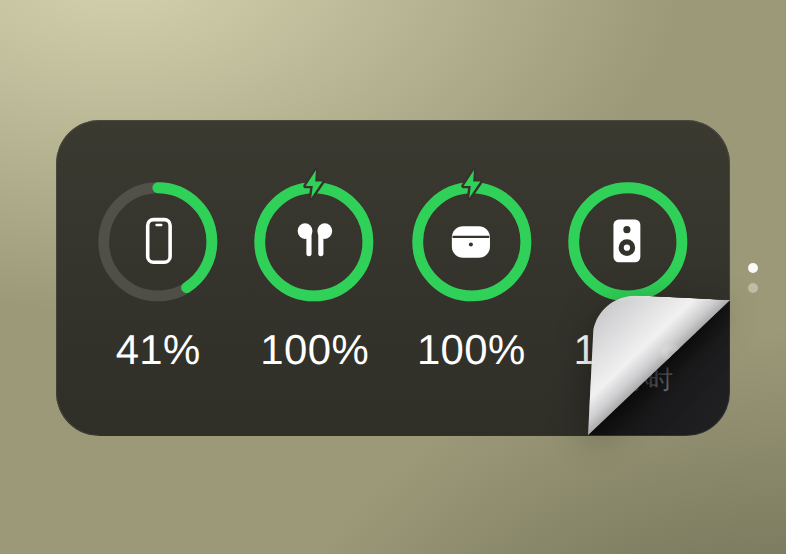
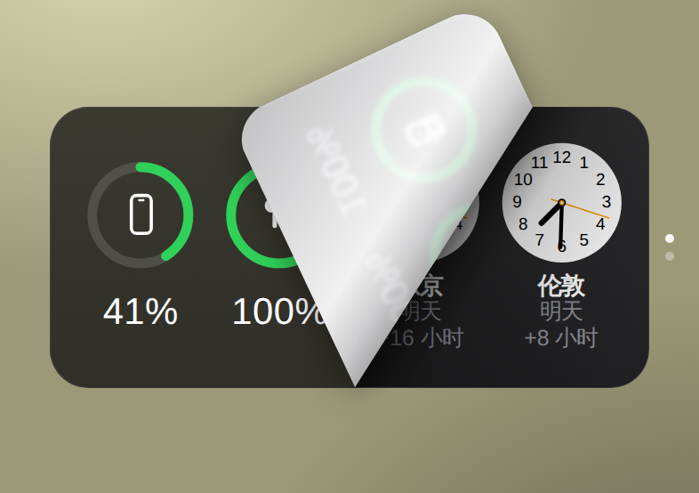
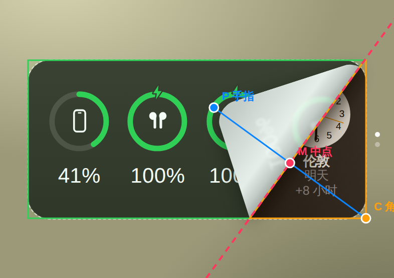

# Peel Widget Stack · 翻角切换小组件原型

## 当前版本：采用了版本 A · Opus

A / B 对比后选定了版本 A（Claude 按自己的判断打磨，没有参考任何 skill）。和最初的版本比：

- **纸角更像真的纸卷**：折痕处有一道窄窄的反光，像纸卷起来的那一圈，不再是一大片「金属板」一样的亮光
- **影子会跟着高度变**：纸角贴着卡片的地方影子很实，掀得越高，影子离得越远、越柔和
- **下面那张卡看得更清楚**：只在折痕旁边暗一小条，掀得再大也不会被阴影盖住一大片
- **按住就有回应**：手指刚按住角落、还没拖，纸角就先轻轻翘起一点，告诉你「抓住了」（调参面板里可以调大小或关掉）
- **手机上应该更省力**：影子和光影换成了更轻的画法，拖动时应该更顺（还没在真 iPhone 上测过，要你试了才知道）

三个版本对比着玩：[基础版](https://boxi687.github.io/Flip-Mac-Card-Component/) ·
[版本 A](https://boxi687.github.io/Flip-Mac-Card-Component/a/) ·
[版本 B](https://boxi687.github.io/Flip-Mac-Card-Component/b/)

---

一个 iOS 桌面小组件的交互原型：两张叠在一起的小组件（电池 / 世界时钟），
**按住任意一个角拖动**，就能像掀纸一样偷看下面那张；**松手后纸角自动盖回**，上面那张不会换。

<p align="center">
  
  
  
</p>

- 纯 HTML / CSS / JavaScript，**没有任何依赖、不需要构建**
- 在 iPhone Safari 里打开 → 「添加到主屏幕」，就能全屏把玩
- 页面底部有「调参」按钮：不用写代码就能调手感和外观，还能打开几何辅助线看翻角背后的数学

## 怎么调效果（不用写代码）

1. 在手机上打开页面（网址见下面「快速开始」）
2. 点页面底部的 **「调参」**，面板从下面滑上来，卡片还露在上面。
   **在电脑上（窗口够宽时）**，面板是立在右边的侧边栏，一打开页面就开着，卡片自动挪到左边空出来的地方，不会被挡住；点「收起」或再点一下「调参」可以收起，下次打开会记住你的选择
3. **一边拖卡片的角，一边拖面板里的滑块**，改动马上生效。每个滑块下面有一句话说明它管什么；滑块上的小竖线是默认值的位置，改过的数字会变成蓝色
4. 满意了，点 **「复制参数」**，把复制出来的那一小段文字**直接粘贴发给 Claude**，说「把这些设成默认值」就行

> 调过的值会记在这台手机上，下次打开还在；点「恢复默认」可以回到原样。

## 快速开始

| 想做什么 | 怎么做 |
| --- | --- |
| 在电脑上看 | 直接双击 `index.html`，用 Chrome 打开 |
| 模拟手机 | Chrome 里按 `F12` → `Ctrl + Shift + M`，选一个 iPhone 机型 |
| 在 iPhone 上玩 | 开启 GitHub Pages（见教程第 8 步），用 Safari 打开网址 → 分享 → 添加到主屏幕 |

## 👉 一步一步的教程

**[docs/TUTORIAL.md](docs/TUTORIAL.md)**：从零讲清楚每一步在做什么、为什么这么做。

## 文件结构

```
index.html            页面骨架 + 「添加到主屏幕」相关设置
css/style.css         所有样式（小组件外观 + 翻角图层）
js/geometry.js        翻角的全部数学（纯函数，不碰 DOM）
js/widgets.js         两个小组件的渲染（电池圆环、世界时钟）
js/peel.js            翻角交互引擎（手势、裁剪、镜像、光影、弹簧动画；可调参数的默认值在顶部）
js/tuner.js           页面上的「调参」面板
js/main.js            把上面这些组装起来
manifest.webmanifest  PWA 清单（主屏幕图标、全屏打开）
icons/                主屏幕图标
docs/                 教程和配图
```
